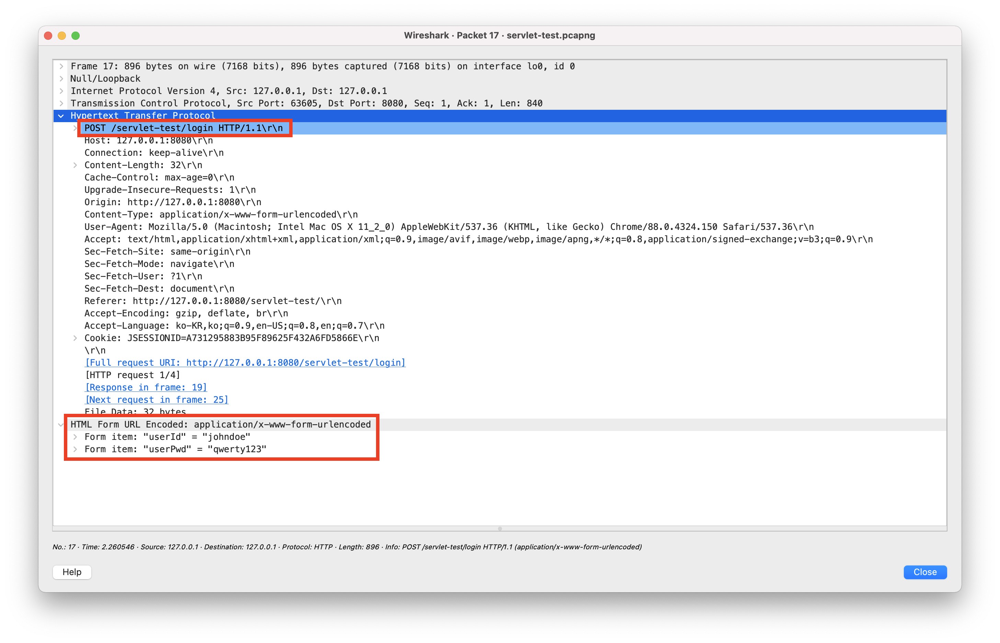
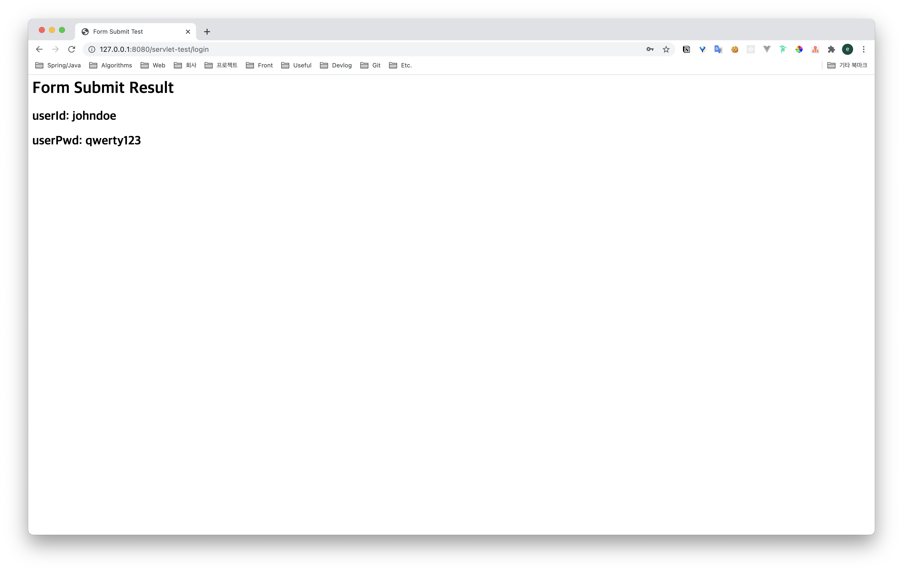
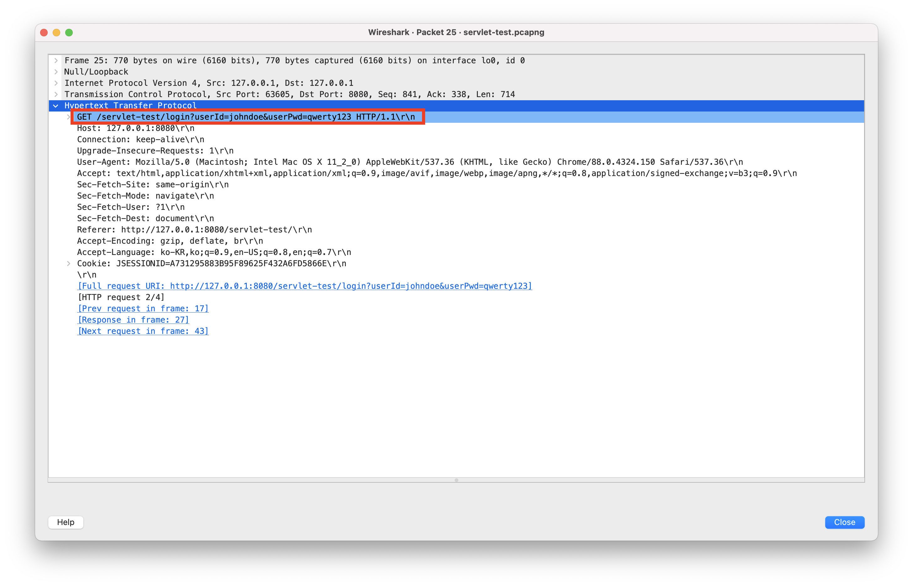
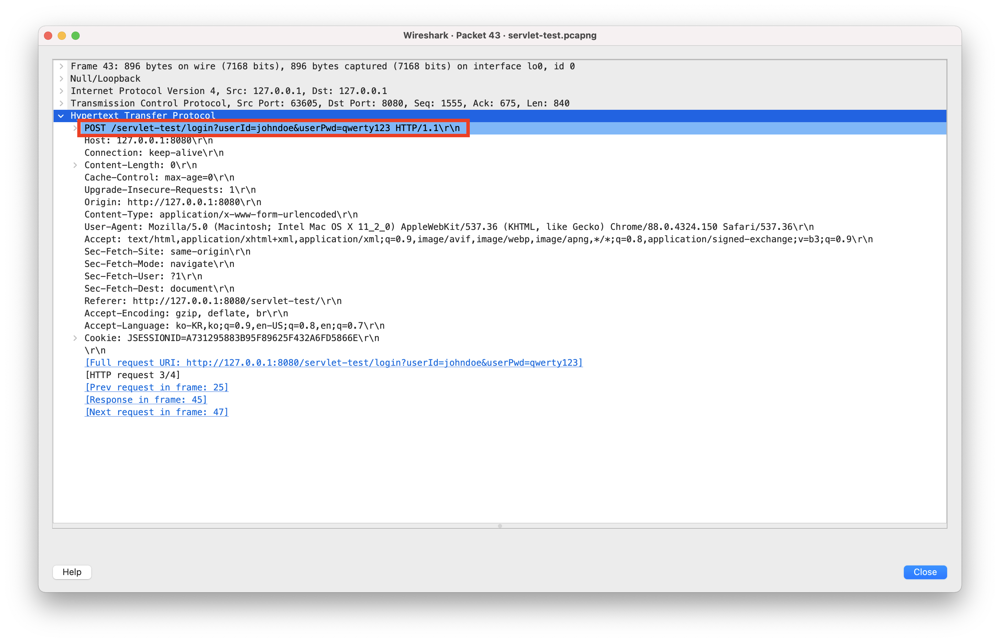
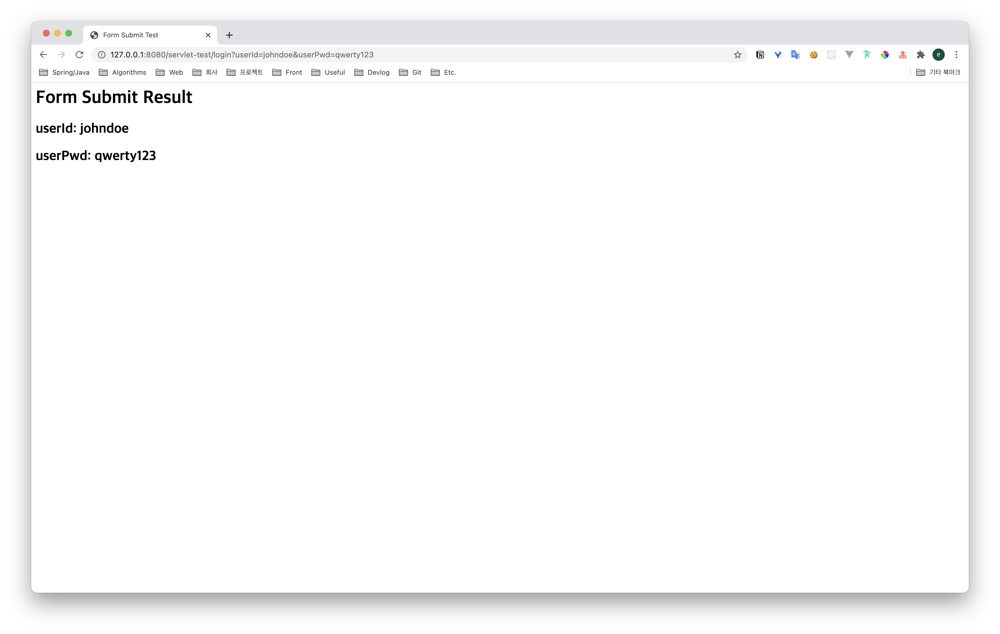
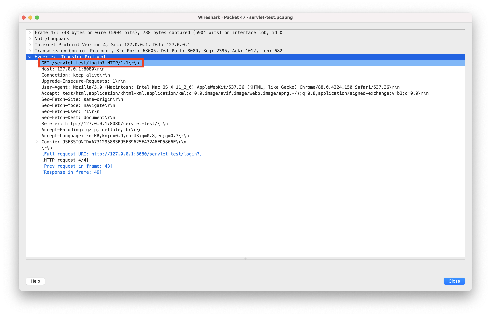
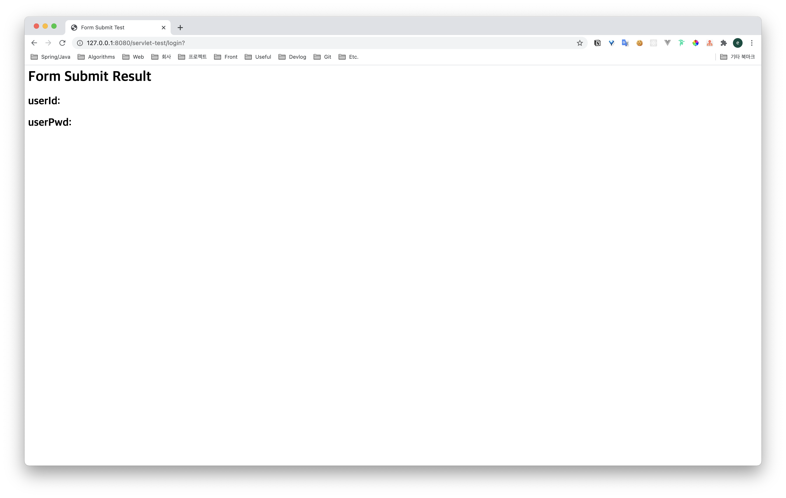

form 태그를 이용해 서버로 데이터를 전송할 때 데이터가 제대로 전송되지 않는 현상을 겪었다. 우선, 이 현상이 발생하는 조건은 다음과 같다.

- GET 방식 사용 (`method="get"`)
- 쿼리 스트링 사용 (`action="/form-test?param1=value1"`)

즉, form에서 GET 방식과 쿼리 스트링을 함께 사용할 때 쿼리 스트링에 담긴 매개변수 값(`param1=value1`)이 서버로 전송되지 않았다. 그렇다면 POST 방식은 제대로 동작하는 것인지, 쿼리 스트링이 아닌 input 태그를 이용하면 제대로 동작하는 것인지 궁금증이 생겨 테스트해보았다.


# form submit 테스트

form 태그를 이용해 데이터를 전송할 수 있는 네 가지 방식을 만들어 보았다. 서블릿 프로젝트를 만들어 테스트했다.


## 테스트 프로젝트 구성

### index.jsp

네 가지 방식으로 서버에 데이터를 전송하는 form을 만들었다. Login 버튼을 클릭하면 userId와 userPwd 값이 HTTP Request에 담겨 LoginServlet으로 전송된다.

```html
<%@ page contentType="text/html; charset=UTF-8" pageEncoding="UTF-8" %>
<!DOCTYPE html>
<html>
<head>
    <title>Form Submit Test</title>
</head>
<body>
    <h1>Form Submit</h1>
    <div>
        <h2>1. POST 방식 & input 태그</h2>
        <form action="login" method="post">
            <input type="text" name="userId" value="johndoe"/>
            <input type="password" name="userPwd" value="qwerty123"/>
            <button type="submit">Login</button>
        </form>
    </div>
    <hr/>
    <div>
        <h2>2. GET 방식 & input 태그</h2>
        <form action="login" method="get">
            <input type="text" name="userId" value="johndoe"/>
            <input type="password" name="userPwd" value="qwerty123"/>
            <button type="submit">Login</button>
        </form>
    </div>
    <hr/>
    <div>
        <h2>3. POST 방식 & 쿼리 스트링</h2>
        <form action="login?userId=johndoe&userPwd=qwerty123" method="post">
            <button type="submit">Login</button>
        </form>
    </div>
    <hr/>
    <div>
        <h2>4. GET 방식 & 쿼리 스트링</h2>
        <form action="login?userId=johndoe&userPwd=qwerty123" method="get">
            <button type="submit">Login</button>
        </form>
    </div>
</body>
</html>
```


### LoginServlet.java

LoginServlet에서는 request 객체의  `getParameter()` 메서드를 이용해 쿼리 스트링이나 HTTP Request Body에 담긴 데이터를 가져온다. 서버에서 데이터를 잘 전달받았는지 쉽게 확인하기 위해 request 객체에 userId와 userPwd를 attribute로 추가하여 `result.jsp` 로 forward 했다.

```java
@WebServlet(name = "loginServlet", value = "/login")
public class LoginServlet extends HttpServlet {

    public void handle(HttpServletRequest request, HttpServletResponse response) throws IOException {
        response.setContentType("text/html");

        String userId = request.getParameter("userId");
        String userPwd = request.getParameter("userPwd");

        RequestDispatcher requestDispatcher = request.getRequestDispatcher("result.jsp");
        request.setAttribute("userId", userId);
        request.setAttribute("userPwd", userPwd);

        try {
            requestDispatcher.forward(request, response);
        } catch (ServletException e) {
            e.printStackTrace();
        }
    }

    @Override
    public void doGet(HttpServletRequest request, HttpServletResponse response) throws IOException {
        handle(request, response);
    }

    @Override
    protected void doPost(HttpServletRequest request, HttpServletResponse response) throws ServletException, IOException {
        handle(request, response);
    }
}
```


### result.jsp

LoginServlet에서 request 객체에 attribute로 추가했던 userId와 userPwd 값을 EL을 이용해 출력했다.

```html
<%@ page contentType="text/html;charset=UTF-8" language="java" %>
<html>
<head>
    <title>Form Submit Test</title>
</head>
<body>
    <h1>Form Submit Result</h1>
    <hr/>
    <h2>userId: ${userId}</h2>
    <h2>userPwd: ${userPwd}</h2>
</body>
</html>
```


## 1. POST 방식 & input 태그 

먼저, input 태그에 데이터(userId, userPwd)를 담아 POST 방식으로 서버(LoginServlet)에 요청을 전송했다.

```html
<form action="login" method="post">
  <input type="text" name="userId" value="johndoe"/>
  <input type="password" name="userPwd" value="qwerty123"/>
  <button type="submit">Login</button>
</form>
```


### HTTP Request



Login 버튼을 누르면 다음과 같이 HTTP Request가 전송된다. HTTP Request의 시작 행을 보자.

```http
POST /servlet-test/login HTTP/1.1
```

- `POST`: 해당 요청이 POST 방식의 요청임을 나타낸다.
- `/servlet-test/login`: 요청을 받을 서버상의 위치, 서버 URL을 나타낸다. 프로젝트의 Context Path인 `/servlet-test` 에 form 태그에 작성한 action 속성값이 추가되어 `/servlet-test/login` 으로 요청이 전송되었다.
- `HTTP/1.1`: 해당 요청이 HTTP 1.1 정의에 따른다는 것을 나타낸다.

HTTP Request Body에는 input 태그에 입력한 값이 담겨 전송되었다. form 에서 POST 방식으로 요청을 전송하면 input 태그의 값들이 `&` 로 연결되어 `name=value` 의 형태로 전송된다. 

```http
userId=johndoe&userPwd=qwerty123
```


### 결과 화면

HTTP Request Body로 전달받은 userId와 userPwd 값이 정상적으로 출력되는 것을 확인할 수 있다.




## 2. GET 방식 & input 태그

다음으로, input 태그에 데이터를 담아 GET 방식으로 서버에 요청을 전송했다. [HTML 명세](https://www.w3.org/TR/REC-html40/interact/forms.html#h-17.13.1)에 따르면 GET 방식을 사용할 경우 input 태그의 값들이 action 속성에 적힌 URL 뒤에 쿼리 스트링 형태로 덧붙여진다.

```html
<form action="login" method="get">
  <input type="text" name="userId" value="johndoe"/>
  <input type="password" name="userPwd" value="qwerty123"/>
  <button type="submit">Login</button>
</form>
```


### HTTP Request



HTTP Request의 시작 행은 다음과 같다.

```http
GET /servlet-test/login?userId=johndoe&userPwd=qwerty123 HTTP/1.1
```

- `GET`
- `/servlet-test/login?userId=johndoe&userPwd=qwerty123`: 프로젝트의 Context Path인 `/servlet-test` 에 form 태그에 작성한 action 속성값이 추가되었고 input 태그의 값들이 쿼리 스트링 형태로 덧붙여졌다.
- `HTTP/1.1`


### 결과 화면

쿼리 스트링으로 전달받은 userId와 userPwd 값이 정상적으로 출력되는 것을 확인할 수 있다.


## 3. POST 방식 & 쿼리 스트링

이번에는 쿼리 스트링에 데이터를 담아 POST 방식으로 서버에 요청을 전송했다. input 태그는 사용하지 않았다.

```html
<form action="login?userId=johndoe&userPwd=qwerty123" method="post">
  <button type="submit">Login</button>
</form>
```


### HTTP Request

HTTP Request의 시작 행은 다음과 같다.

```http
POST /servlet-test/login?userId=johndoe&userPwd=qwerty123 HTTP/1.1
```

- `POST`
- `/servlet-test/login?userId=johndoe&userPwd=qwerty123`: 프로젝트의 Context Path인 `/servlet-test` 에 form 태그에 작성한 action 속성값이 추가되어 `/servlet-test/login?userId=johndoe&userPwd=qwerty123` 으로 요청을 전송했다.
- `HTTP/1.1`


### 결과 화면

쿼리 스트링으로 전달받은 userId와 userPwd 값이 정상적으로 출력되는 것을 확인할 수 있다.




## 4. GET 방식 & 쿼리 스트링

문제가 발생했던 방식이다. 쿼리 스트링에 데이터를 담아 GET 방식으로 서버에 요청을 전송했다.

```html
<form action="login?userId=johndoe&userPwd=qwerty123" method="get">
  <button type="submit">Login</button>
</form>
```


### HTTP Request



HTTP Request의 시작 행은 다음과 같다.

```http
GET /servlet-test/login? HTTP/1.1
```

- `GET`
- `/servlet-test/login?`: 이상하다. 분명히 form 태그의 action 속성에 `login?userId=johndoe&userPwd=qwerty123` 이라고 적었는데 `login?` 뒤에 있는 쿼리 스트링 매개변수 값이 사라진 것을 확인할 수 있다. form의 내부 동작 방식이 내 생각과 다르다는 것을 알게 되었다.
- `HTTP/1.1`


### 결과 화면

쿼리 스트링이 삭제된 상태로 요청이 전송되었으므로 LoginServlet에서 `request.getParameter("userId")` 와 `request.getParameter("userPwd")` 를 호출하면 해당하는 값을 찾지 못하고 null 을 반환하게 된다. 결과 화면에서는 null 값이 들어 있는 userId와 userPwd가 다음과 같이 출력된다.




# form submission algorithm

[스택 오버플로우](https://stackoverflow.com/questions/1116019/submitting-a-get-form-with-query-string-params-and-hidden-params-disappear)에서 나와 비슷한 현상을 겪은 사람의 글을 발견할 수 있었다. 원인은 바로 HTML5 명세 중 4.10.22.3 Form submission algorithm에 나와 있었다. form 태그에서 GET 방식을 사용할 경우 "Mutate action URL" 과정을 거치게 되는데 말 그대로 action URL을 변형하는 것이다.

> ***Mutate action URL***
>
> Let *query* be the result of encoding the *form data set* using the [`application/x-www-form-urlencoded` encoding algorithm](https://www.w3.org/TR/2011/WD-html5-20110525/association-of-controls-and-forms.html#application-x-www-form-urlencoded-encoding-algorithm), interpreted as a US-ASCII string.
>
> Let *destination* be a new [URL](https://www.w3.org/TR/2011/WD-html5-20110525/urls.html#url) that is equal to the action except that its [`<query>`](https://www.w3.org/TR/2011/WD-html5-20110525/urls.html#url-query) component is replaced by *query* (adding a U+003F QUESTION MARK character (?) if appropriate).

명세에 따르면 form에 input 태그가 존재할 경우 input 태그의 name과 value 쌍을 쿼리 스트링(`?name1=value1`)으로 구성한다. 그리고 action URL에 이미 `?`로 시작하는 쿼리 스트링이 있다면 제거하고 그 자리에 새로 만든 쿼리 스트링을 덮어씌운다. 만약 form에 input 태그가 없다면 action URL에는 `?` 만 추가되는 것이다.

따라서 action 속성에 쿼리 스트링이 있는 URL을 넣고 GET 방식으로 요청을 전송했을 때 action URL에 있던 기존 쿼리 스트링이 지워지고 (input 태그가 없었기 때문에) `?` 만 남은 상태로 요청이 전송되었다는 사실을 깨달았다.


# 참고자료
- 웹 문서
  - https://www.w3.org/TR/REC-html40/interact/forms.html#h-17.13.1
  - https://stackoverflow.com/questions/1116019/submitting-a-get-form-with-query-string-params-and-hidden-params-disappear
  - https://www.w3.org/TR/2011/WD-html5-20110525/association-of-controls-and-forms.html#application-x-www-form-urlencoded-encoding-algorithm